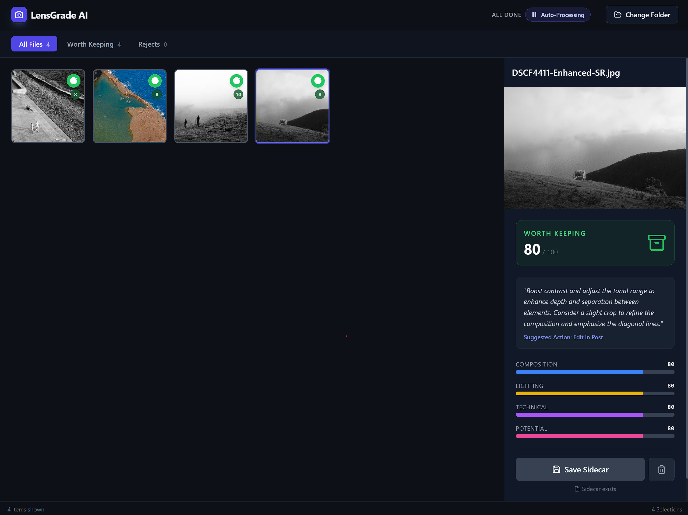

# SnapShot Gatekeeper

SnapShot Gatekeeper is an AI-powered photography curation tool designed to help photographers quickly sort through thousands of images. It uses Google's Gemini AI to evaluate photos, detect bursts, and suggest which shots to keep.

## UI Overview

### Landing Page


### Folder View & Grading


## Features

- **AI-Powered Grading**: Automatically evaluates images for technical quality (sharpness, exposure) and artistic composition.
- **Burst Detection**: Intelligently groups burst shots ensuring consistent grading across similar images and saving API tokens.
- **XMP Persistence**: Grading results are saved as standard XMP sidecar files, making them compatible with Lightroom, Capture One, and other editing software.
- **Individual Picture UI**: Detailed inspector panel to view AI reasoning and file details.
- **Smart Filtering**: Quickly toggle between "Worth Keeping" and "Rejected" images to focus on your best shots.
- **Automated Cleanup**: Efficient workflow to move rejected files to a `_Rejected` subfolder for easy cleanup.
- **Local-First**: Works directly with your local file system using the File System Access API.

## Run Locally

**Prerequisites:** Node.js (v18+ recommended)

**Tip:** Use NVM (Node Version Manager) to manage your Node.js versions.

1. Install dependencies:
   ```bash
   npm install
   ```

2. Configure Environment:
   Create a `.env.local` file in the root directory and add your Gemini API key:
   ```
   GEMINI_API_KEY=your_api_key_here
   ```

3. Run the app:
   ```bash
   npm run dev
   ```
